# Social-network
Ссылка: https://alexaltrex.github.io/Social-network

## Описание
Социальная сеть.

## Запуск проекта:
Для установки и запуска необходимы установленные программы: Node.js, npm, Git;
1. Клонирование и запуск: git clone https://github.com/Alexaltrex/Social-network.git;
2. Переход в директорию с проектом: cd Social-network;
3. Установка зависимостей: npm install;
4. Запуск проекта в режиме разработки: npm start;
5. Перейти в браузер и открыть страницу: http://localhost:3000.

## Цель проекта
* Изучение основных паттернов разработки социальных сетей (авторизация, пагинация, обработка сообщений)
* Переход от классовых компонент на функциональные с применением хуков
* Изучение основных паттернов типизации React-приложения
* Изучение библиотеки Material-UI

## Разработка
* Приложение разработано на базе библиотеки React v.16.13.1 с использованием Create React App (https://github.com/facebook/create-react-app)
* Приложение разработано на базе API: 'https://social-network.samuraijs.com/api/1.0/'
* Глобальное состояние: управление - Redux v.4.0.5, доступ - хуки useSelector и useDispatch
* Локальное состояние: хук "useState"
* Побочные эффекты: хук "useEffect"
* Роутинг: React-router-dom v.5.2.0
* Асинхронный код: Redux-thunk v.2.3.0
* Сетевые запросы: Axios v.0.19.2
* Работа с формами: Redux-form v.8.3.6
* Дизайн: Material-UI v.4.11.0
* Типизация - Typescript v.3.7.2

## Структура проекта

### 1. Заголовок:
* Логотип;
* Поле поиска пользователей;
* Кнопка авторизации. 
Для авторизованного пользователя содежит имя пользователя и аватар, активирует всплывающее меню с пунктами: выйти, настройки; для неавторизованного пользователя - переход на форму авторизации.

### 2. Главная боковая панель навигации. 
Содержит ссылка на страницы: "Мой профиль", "Диалоги", "Пользователи", "Друзья", "Настройки".
### 3. Главный контент. 
Для авторизованного пользователя показывает содержимое соответствующей пункту бокового меню страницы. Для неавторизованного пользователя показывает форму авторизации: поля ввода почты, пароля (есть опция сделать пароль видимым), запомнить меня и кнопка подтверждения. Форма поддерживает локальную валидацию на необходимость заполнения, отсутствия строк, состоящих из пробельных символов и серверную на правильность авторизационных данных. 

При 10 неудачных попытках авторизации показывается каптча и поле для ввода символов с каптчи. 

#### 3.1. Страница "Мой профиль".
##### 3.1.1. Аватар и кнопка редактирования профиля. 
Для аватара реализованы появляющиеся при наведении кнопки смены изображения и удаления (удаление реализовано локально, т.к. api не поддерживает удаление).

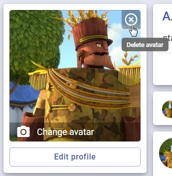

##### 3.1.2. Блок с информацией о друзьях.
Ссылка на страницу 'Друзья', количество друзей, блок с аватарами-ссылками (и именами) на страницы профилей друзей. Блок содежит первые 9 или меньше (если по факту их всего меньше 9) друзей.
##### 3.1.3. Блок основной информации об авторизированном пользователе.
Имя, статус (при клике появляется всплывающее окно с формой ввода нового статуса), кнопка скрыть/показать подробную информацию, блок с подробной информацией.

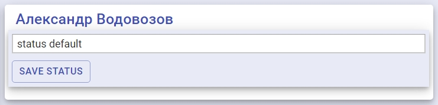

##### 3.1.4. Блок с формой ввода нового поста.
При клике по блоку статичный текст "Введите ваш пост" заменяется на форму ввода поста, при клике вне блока - форма заменяется на статичный текст. Посты хранятся локально, т.к. api не поддерживает работу с постами.
##### 3.1.5. Блоки с текстами постов. 
Аватор авторизованного пользователя - автора поста, имя - ссылка на профиль, дата размещения поста, текст поста, кнопка с вслывающим контекстым меню с опцией - удалить пост, кнопка 'поставить лайк', количество лайков.

##### 3.1.6. Режим редактирования профиля.
В режиме радактирования профиля блоки 3.1.3, 3.1.4 и 3.1.5 заменяются на форму ввода детальной информации (локальная валидация на строки состоящие из пробельных символов) и дополнительную боковую панель с выбором раздела дополнительной информации.

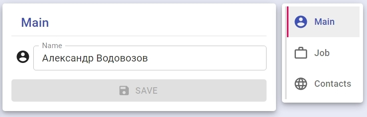

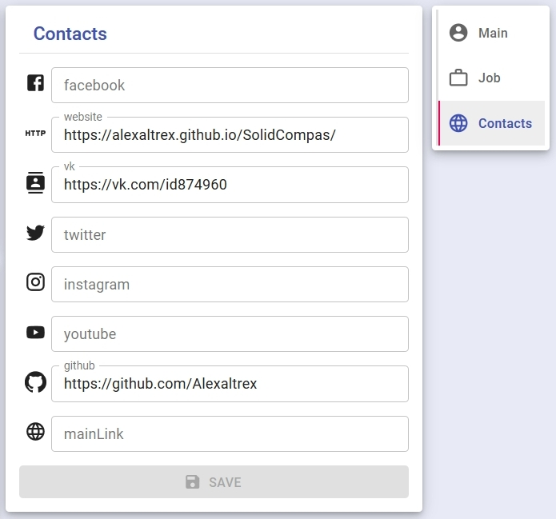

#### 3.2. Страница "Диалоги".
##### 3.2.1. Вспомогательное боковое меню
Содержит список режимов просмотра диалогов - 'все' или 'удаленные'.
##### 3.2.2. Блок диалогов. 
В режиме 'все' - список пользователей, с кем ведется диалог, в режиме 'удаленные' - список пользователей, из диалогов с которыми удалялись сообщения. Каждый элемент списка является кнопкой, активирующей список сообщений из данного диалога, содержит аватар пользователя, имя - ссылку на его профиль и дату последнего сообщения. При отсутствии диалогов выводится сообщение - диалогов нет (или удаленных диалогов нет).
##### 3.2.3. Блок сообщений.
Состоит из заголовка, списка сообщений и формы ввода сообщений (отсутствует в режиме 'удаленные'). Заголовок содержит аватар собеседника, имя - ссылку на его профиль, сообщение о количестве выделенных сообщений (опционально), кнопку снять выделение (опционально), кнопку 'удалить сообщения' - для режима 'все' или восстановить сообщения - для режима 'удаленные' (удаленные сообщения хранятся локально, т.к. api не поддерживает их хранение). Каждый элемент списка сообщений содержит: иконку 'выделено' (в случае его выделения), аватар отправителя, имя - ссылку на его профиль, дату отправления, текст сообщения, иконку, обозначающую, куда отправлено сообщение - вам или от вас. Форма ввода сообщений содержит поле ввода (локальная валидация на текст состоящий из пробельных символов) и кнопку 'отправить сообщение'.

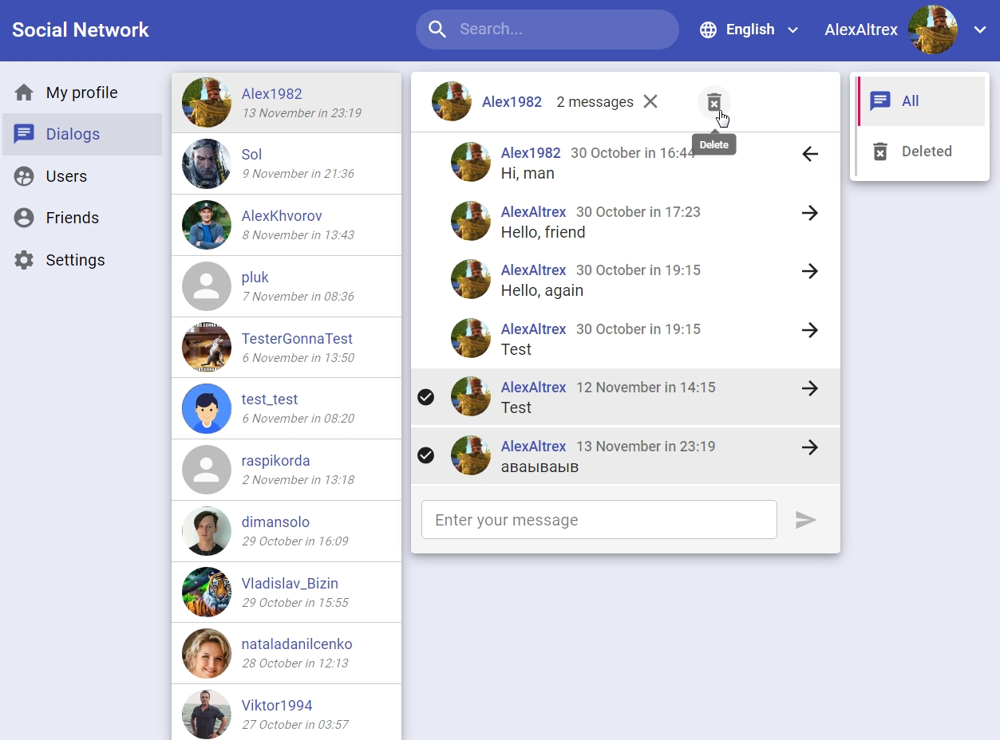
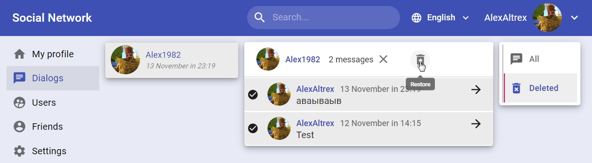

При удачном отправлении сообщения появляется всплывающее в левом нижнем углу экрана модальное окно. 

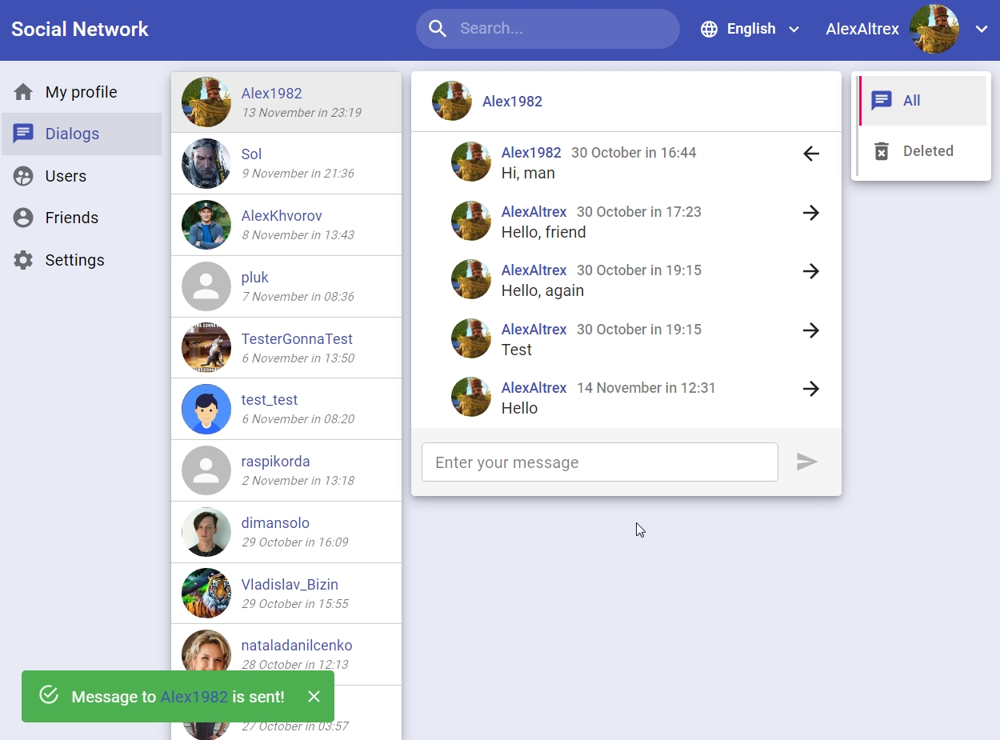

#### 3.2. Страница "Пользователи".
##### 3.2.1. Панель поиска.
Содержит форму ввода параметров поиска: имя и фильтр дружбы (друг, не друг, все). Форма осуществляет локальную валидацию на строки состоящие из пробельных символов. Поиск из заголовка соответствует фильту дружбы "все".

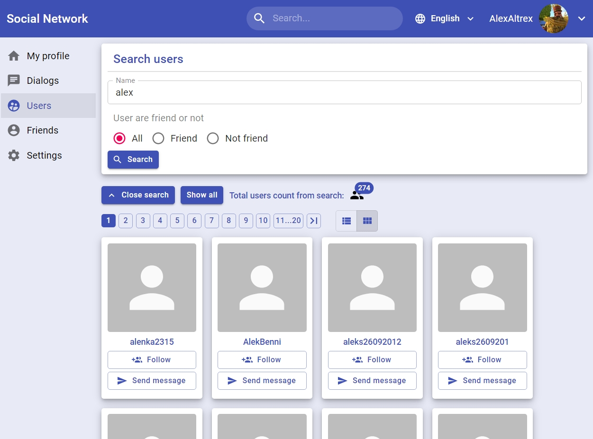

##### 3.2.2. Блок управления и информации.
Содержит кнопку открытия панели поиска 3.2.1, кнопку сброса поиска (показывать всех), сообщение об источнике показа пользователей (все или поиск) и число пользователей
##### 3.2.3. Блок пагинации и вида отображения данных.
* Пагинация: одна страница содержит 10 пользователей, диапазон пагинации - 10 страниц, есть кнопки перехода на следующий/предыдущий диапазон страниц и кнопки перехода на первую/последнюю страницу.
* Переключатель вида отображения данных: списком или карточками (по определению).

##### 3.2.4. Блок данных о пользователях.
Оформляется списком или карточками. Каждый элемент содержит аватар пользователя, имя-ссылку на страницу с профилем пользователя, кнопку "отправить сообщение" и кнопку "добавить в друзья/удалить из друзей". Во время запроса дружбы кнопки становятся неактивными, показывается прелоадер:

##### 3.2.5. Страница с профилем пользователя '/users{id}'.
По оформлению аналогична странице "Мой профиль", за исключением:
* Нет возможности редактировать статус
* Нет возможности редактировать профиль
* В блоке с аватаром добавлены кнопки "добавить в друзья/удалить из друзей" и "отправить сообщение". 

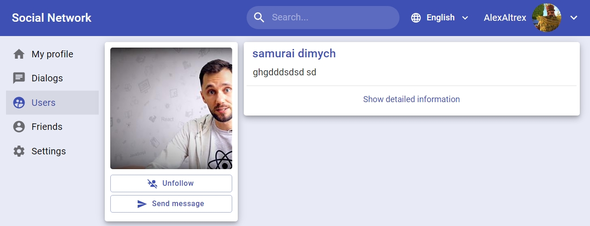

#### 3.2. Страница "Друзья".
#### 3.2.1 Блок со списком друзей.
* Надпись "Друзья" и количество друзей (всех или из поиска).
* Форма поиска. Поиск по имени, локальная валидация на пустую строку и строку состоящую из пробельных символов. Поиск осуществляется при каждом вводе символа. При осуществленном поиске слево появляется кнопка очистки формы.

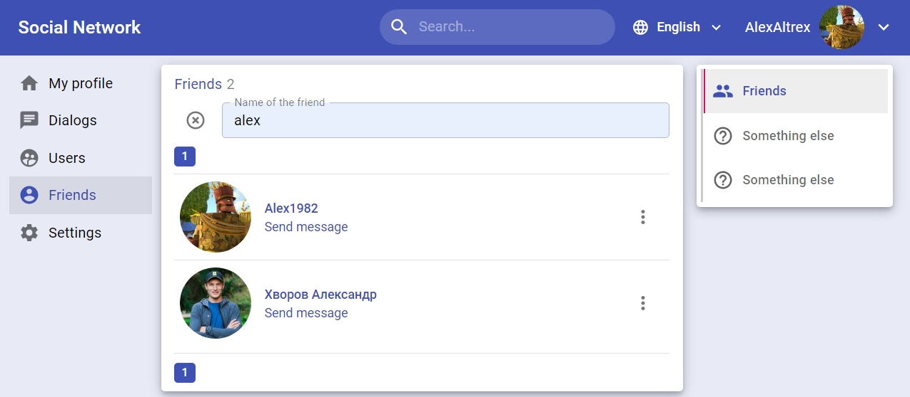

* Список друзей. Каждый элемент списка содержит: аватар, имя-ссылку на страницу провиля друга, кнопку "отправить сообщение" и кнопку, активирующую всплывающее меню со списком команд (удалить из друзей).

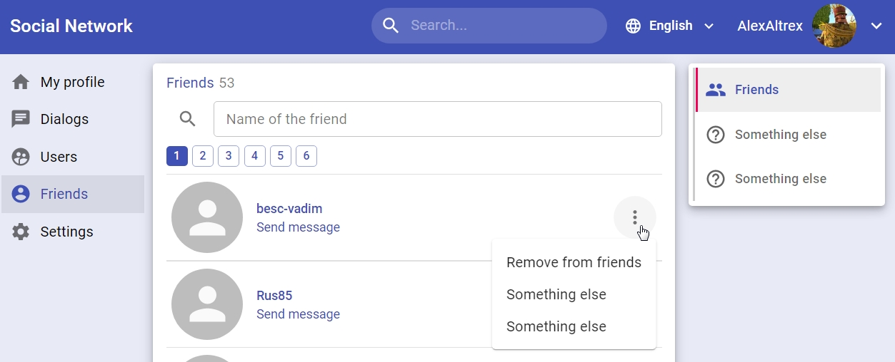

